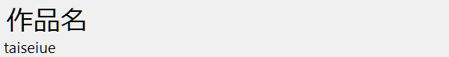

# Desktop NameTag

    
    <h3>展示用名前プレート</h3>
    
ディスプレイ左上に作品名と作者を表示するソフトウェア

### What's this?

もしデジタル作品の展示時に名札を忘れても、このソフトウェアがあれば大丈夫です。
このソフトウェアを使うと、ディスプレイ左上に作品名と作者名を表示できます。
デジタル名札は常に手前に表示されるので、フルスクリーンコンテンツの展示にももってこいです。

このソフトウェアはごく簡単な仕組みのWindows Formsアプリケーションで、ウィンドウの外枠を表示せず、常に前面に表示させ続けることで実現しています。このソフトウェアは.Net Framework 4.5以降の環境で動作します。(つまり、Windows 8以降の環境では特段の注意なく動作します)

このソフトウェアは2019年春ごろ作成しました。

### Usage

1. Releaseから実行ファイルを取得するか、自分で実行可能ファイルをビルドします。
2. 起動すると、作品名と作者名を入力するフォームが表示されます。入力後、「開始」をクリックすることでデジタル名札を表示できます。
3. デジタル名札を閉じるときは、タスクバー上のアイコンを右クリックして、「ウィンドウを閉じる」を選択します。

### Why did you make it?

当時在籍していた中学校のパソコン部では、文化祭の日に作品展示をしていました。
ところが、作品名や作者を表示するための名札がなかったのです！
そこで私は、必要な情報を表示できるデジタル名札を表示できるこのソフトウェアを作成し、部員に使ってもらいました。

### License

このソフトウェアは、[The MIT License](./LICENSE.txt)のもとで公開します。

Copyright (c) 2019 Taisei Uemura  
Released under the [MIT license](./LICENSE.txt)
